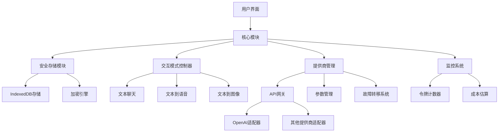

# LLM Chat Web

一个以LLM驱动的聊天功能为核心的安全、模块化Web应用程序，灵感来自ChatGPT的界面，但具备增强功能。

## 项目概述

LLM Chat Web是一个纯前端应用，使用Vue 3和Vuetify构建，提供与多种大型语言模型的交互界面。应用支持文本聊天、语音合成和图像生成三种核心交互模式，同时实现了多提供商配置、安全凭证存储和高级用户体验功能。

## 架构图



## 核心功能

### 安全存储

- 使用IndexedDB/localStorage安全存储API密钥和URL
- 客户端加密保护敏感凭证
- 公共计算机使用警告

### 交互模式

- 支持Markdown的文本聊天
- 可定制的文本到语音合成
- DALL-E图像生成

### 多提供商支持

- 动态API端点管理
- 流行服务预设配置
- 实时提供商切换
- 自定义参数调优

### 高级功能

- 跨提供商故障转移
- 加密凭证存储
- 自适应用户界面
- 令牌使用监控和成本估算（CNY）

## 快速开始

### 安装依赖

```bash
npm install
```

### 开发模式启动

```bash
npm run dev
```

### 构建生产版本

```bash
npm run build
```

## 部署指南

### GitHub Pages自动部署

本项目已配置GitHub Actions工作流，可自动部署到GitHub Pages：

1. 将代码推送到GitHub仓库的main分支
2. GitHub Actions会自动触发构建和部署流程
3. 部署完成后，应用将可通过`https://<用户名>.github.io/<仓库名>/`访问

#### 手动设置GitHub Pages部署

如果需要手动设置GitHub Pages部署，请按照以下步骤操作：

1. 在GitHub仓库中，进入Settings > Pages
2. 在Source部分，选择GitHub Actions
3. 确保仓库中存在`.github/workflows/deploy.yml`文件
4. 推送代码到main分支，触发自动部署

#### 本地测试部署配置

在本地测试部署配置时，可以使用以下命令：

```bash
# 构建生产版本
npm run build

# 预览构建结果
npm run preview
```

## 配置指南

### API提供商配置

1. 点击设置图标打开配置面板
2. 选择"添加新提供商"
3. 填写API密钥和基础URL
4. 选择支持的功能和默认参数
5. 保存配置

### 安全设置

1. 进入安全设置面板
2. 设置主密码用于加密存储
3. 配置自动锁定时间
4. 启用/禁用公共计算机警告

## 技术栈

- **前端框架**: Vue 3 + TypeScript
- **UI组件**: Vuetify 3
- **状态管理**: Pinia
- **API客户端**: Axios
- **Markdown渲染**: marked + highlight.js
- **加密**: Web Crypto API

## 隐私说明

本应用遵循隐私设计原则：

- 所有数据和凭证仅存储在本地
- 不收集或传输用户数据
- API请求直接从客户端发送到提供商
- 无服务器端组件或数据存储

## 许可证

MIT
